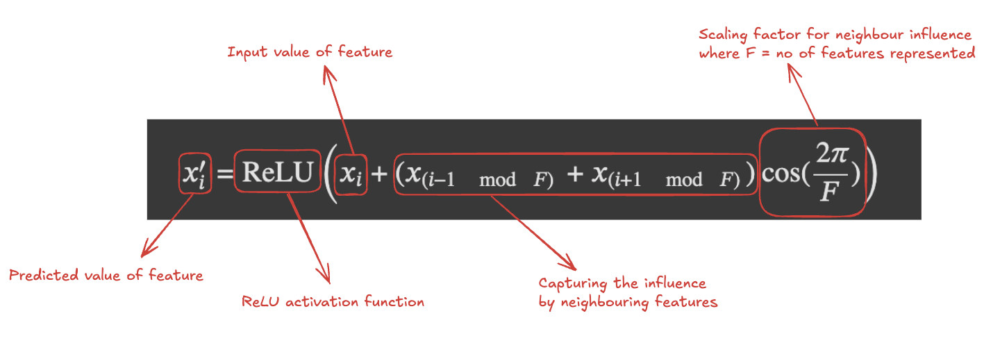
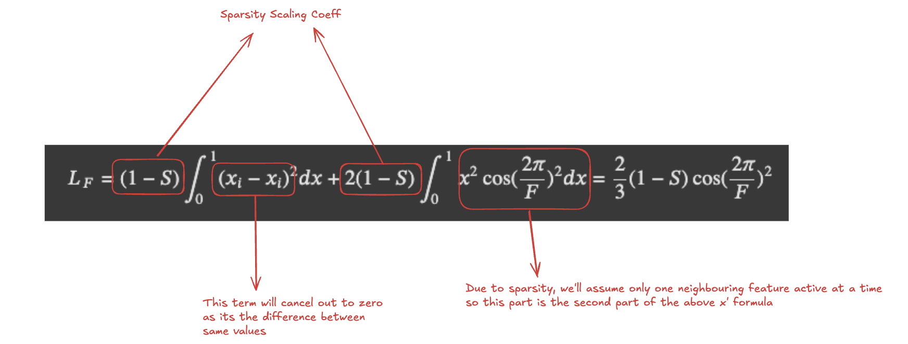
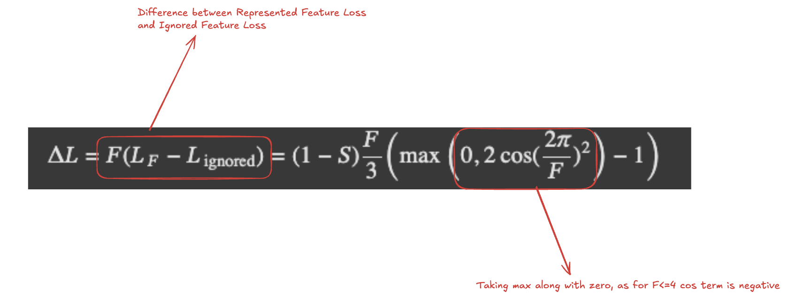

Repost from LessWrong, check out th LW post [here](https://www.lesswrong.com/posts/WwxG8RRHrorJgpoAk/effects-of-non-uniform-sparsity-on-superposition-in-toy)

# Abstract

For the past couple of years, toy models have been extensively studied in the field of mechanistic interpretability. We studied the introduction of superposition, feature geometry, and how correlation/anticorrelation/uncorrelated features arrange themselves in either situation. This work is my attempt to empirically validate and analyze why feature geometry in the infinite data regime for a ReLU model (with hidden=2) caps at a Pentagon geometry irrespective of the number of inputs and contribute to a better understanding of feature geometry in neural networks.

I analyze two factors, i.e., initialization and optimizer, on how they affect the feature geometry. The experimental results align with the theoretical explanation of why the no of features cap at a pentagon geometry minimises the overall loss.

# Introduction

The ReLU output model is a toy model replication of a neural network showcasing the mapping of features (5 input features) to hidden dimensions (2 hidden dimensions) where superposition can be introduced by changing the sparsity of input features. For a set of input features x∈Rn and a hidden layer vector h∈Rm, where n>>m, the model is defined as follows:

$$
h=Wx
$$

$$
x^′=ReLU(W^{T}h+b)
$$

This model showcases how a large set of input features can be represented in a much smaller dimensional vector in a state of superposition by increasing the sparsity of the input features (sparsity tries to replicate the real-world data distribution where certain concepts are sparsely present throughout the training set). This concept and observations were first introduced in Anthropic's [Toy Models of Superposition paper](https://transformer-circuits.pub/2022/toy_model/index.html)

The original experiment was done on $n=5$ input features but when we try to increase the no of input features to more than 5, an interesting phenomena takes place. Given our observations of a quadrilateral with $n=4$ and a pentagon geometry with $n=5$, we would expect feature geometry to be hexagon or heptagon as we increase the no of features, but in reality, the features restrict themselves to a pentagon geometry itself, with the balance of the features (if they are learned by the model), overlapping with the existing 5 directions as show in the figure below.

I wanted to understand and analyze in detail why is this the case and if it can help us improve our understanding of feature geometry in neural networks.
 

  
  
   
  <b> Fig.1 - n_features = 6 (left) and 7 (right) </b>

# Different Data Regimes and Types of Features

Before we dive deep into feature geometry and our experiments, I would like to explain the concept of data regimes because that majorly impacts the type of features our model learns.

The amount of data used to train the model has a massive impact on the types of features the model learns. [Superposition, Memorization, and Double Descent](https://transformer-circuits.pub/2023/toy-double-descent/index.html) showcase the impact of data regimes and how the model memorizes the dataset as features in low data regimes but transitions to learning generalizable features as the amount of data increases.

<b> Fig.2 - As we increase the data size, features transition from data features towards generalizing features and the geometry converges to a pentagon. Source: https://transformer-circuits.pub/2023/toy-double-descent/index.html </b>

We’ll be focusing on the infinite data regimes as that represents the closest condition to real-world models due to the sheer size of datasets they are trained on and as we can see, when we increase the data size, the feature geometry transitions towards the pentagon geometry we talked about, while earlier, the no of features represented were much higher in lower data regimes.

# Theoretical Intuition behind Pentagon Geometry

For building the theoretical intuition for why pentagon geometry is preferred by models, we’ll be walking you through this [notebook](https://colab.research.google.com/drive/1PTGgQt6OuWfAPi2iNn_myB4gQo-8ORAI?usp=sharing#scrollTo=WPyBYJMpxvyt) shared by Anthropic. (Credits to [Tom Henighan](https://tomhenighan.com/) for open-sourcing this explanation)

The key factors governing the feature geometry is the balance between the overall loss of ignored features and the loss of represented features, along with the no of features that are ignored vs represented.

We can define the expected loss due to ignoring a single feature by:

Note: We are considering a sparse regime, as only sparse features are represented in superposition and $S$ represents the probability of $x_i$ being 0 otherwise it takes a value uniformly sampled between 0 and 1.

While the predicted value of $x_i'$ (when the feature is not ignored) can be defined by:

The formula represents the predicted value in the form of the original input value and then bakes in the influence of nearest neighbouring features (if it is positive interference or negative interference). $mod F$ term helps us wrap around the features around every $F$ positions and $(i \pm 1 \mod F)$ refer to the nearest neighbours represented feature index.

After putting the above predicted term formula in the MSE loss formula, we get the below term representing the Loss due to the represented features.

Currently, we have two Loss terms, and based on no of features represented, two loss terms will be pulling the overall loss in opposing directions. Loss due to represented features will increase when we increase the no of represented features due to increased interference from neighbouring features, but we want to avoid the Loss due to ignored features as well. So, the entity we want to minizmise is the difference between $L_F$ and $L_{\text{ignored}}$ i.e.

When we optimize for $\Delta L$, we reach the optimal point of lowest loss at $F=5$.

During the above derivation, we make some assumptions for simplification and due to that the pentagon geometry is not always followed. There are some instances when a hexagon geometry is observed as well as we’ll see in detail in the next section.
